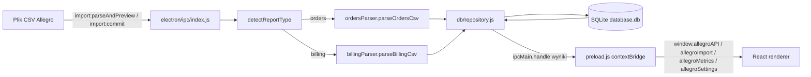

> 📘 Szukasz instrukcji obsługi aplikacji? Zobacz [dokumentację użytkownika](docs/Instrukcja-uzytkownika.md).

# Allegro Profit Analyzer — dokumentacja programistyczna

Lokalna aplikacja desktopowa (Electron + React + SQLite) do importu i analizy eksportów CSV z Allegro (zamówienia i rozliczenia). Wszystkie dane są przetwarzane i przechowywane wyłącznie na dysku użytkownika — aplikacja nie łączy się z siecią.

## Stos technologiczny

- **Electron** (main process) — okno aplikacji, IPC, dostęp do systemu plików i bazy danych.
- **React 18 + TypeScript + Vite** (renderer) — interfejs użytkownika.
- **TailwindCSS** — stylowanie.
- **better-sqlite3** — lokalna baza danych (natywny moduł Node, wymaga kompilacji).
- **Vitest** — testy jednostkowe.
- **electron-builder** — pakowanie do instalatora/portable exe.

## Struktura repozytorium

```
electron/
  main.js              punkt wejścia procesu głównego, tworzy BrowserWindow
  preload.js            most contextBridge (API window.allegroAPI/allegroImport/...)
  db/
    init.js             tworzenie schematu SQLite + migracje kolumn + seed kategorii kosztów
    repository.js        wszystkie zapytania SQL (CRUD, metryki, raporty)
  ipc/
    index.js             rejestracja handlerów ipcMain.handle (jeden kanał = jedna operacja)
  importers/
    detectReportType.js  rozpoznawanie typu CSV po nagłówku kolumn
    ordersParser.js       parser raportu zamówień (sekcje Type=order/lineItem)
    billingParser.js      parser raportu rozliczeń (średnik, format PL)
renderer/
  src/
    App.tsx              routing na poziomie stanu (bez react-router, prosty switch stron)
    pages/                Dashboard, Import, Orders, Products, Costs, Reports, Settings
    components/           MetricCard, MiniChart, AnalysisCharts, UserPanel (nawigacja)
    utils/localization.ts formatowanie dat i tłumaczenia statusów/kategorii na PL
scripts/
  dev.js                 własny orchestrator trybu dev (patrz niżej)
test/                    testy Vitest dla parserów, detekcji typu i repository
docs/
  Instrukcja-uzytkownika.md  dokumentacja końcowego użytkownika
```

## Architektura i przepływ danych



Kluczowe zasady:

- **Renderer nie ma dostępu do Node/Electron** (`contextIsolation: true`, `nodeIntegration: false`). Cała komunikacja idzie przez `contextBridge` w [electron/preload.js](electron/preload.js) i kanały `ipcMain.handle` w [electron/ipc/index.js](electron/ipc/index.js).
- **Wykrywanie typu raportu** odbywa się po nagłówku kolumn ([electron/importers/detectReportType.js](electron/importers/detectReportType.js)) — plik nie wymaga ręcznego oznaczenia typu.
- **Deduplikacja importów**: każdy plik jest hashowany (SHA-256 treści), a hash zapisany w tabeli `imports` z unikalnym indeksem — ponowny import identycznego pliku zwraca `status: 'duplicate'` bez zapisu.
- **Automatyczne wykrywanie produktów**: operacje z rozliczeń bez wpisu w `product_cost` są dodawane automatycznie (`ensureProductsFromBillingOperations`) z kosztem zakupu = `NULL`, do uzupełnienia ręcznie na stronie Produkty.
- **Kategoryzacja kosztów**: tabela `operation_category_map` (zasilana w [electron/db/init.js](electron/db/init.js)) mapuje `operation_type` → kategorię (`commission`, `delivery`, `advertising`, `subscription`, `other_fee`, `internal`).
- **Powiązanie operacji z zamówieniami**: `related_order_id` jest wyciągany regexem ze „Szczegółów operacji” w trakcie parsowania, a `linkBillingOperationsToOrders` domyka pozostałe powiązania po imporcie zamówień w innej kolejności.
- **DB tylko gdy potrzebna**: w trybie dev baza jest inicjalizowana tylko przy `ELECTRON_ENABLE_DB=1` lub gdy aplikacja jest spakowana (`app.isPackaged`); w przeciwnym razie [electron/ipc/index.js](electron/ipc/index.js) używa `repoStub` zwracającego puste/neutralne wartości, żeby UI działał bez bazy.

### Schemat bazy danych (SQLite)

| Tabela | Rola |
|---|---|
| `imports` | log każdego zaimportowanego pliku (nazwa, typ, liczba wierszy, zakres dat, hash) |
| `orders` | zamówienia (`order_id` PK, status, kwota, waluta, marketplace) |
| `line_items` | pozycje zamówień ze zwrotami |
| `billing_operations` | operacje finansowe (kredyt/debet/saldo, kategoria, powiązane zamówienie) |
| `operation_category_map` | słownik `operation_type` → kategoria kosztu / czy jest kosztem |
| `product_cost` | katalog ofert: koszt zakupu, cena sprzedaży, stawki VAT, waluta |
| `saved_reports` | zapisane migawki metryk (JSON) dla wybranego zakresu dat |
| `app_settings` | ustawienia klucz-wartość (waluta domyślna, auto-backup, ścieżka kopii) |

Migracje kolumn dla `product_cost` są dopisywane idempotentnie w `initDatabase` (sprawdzenie `PRAGMA table_info` przed `ALTER TABLE`).

### Kanały IPC (pełna lista w [electron/ipc/index.js](electron/ipc/index.js))

`database:getInfo`, `imports:list`, `metrics:getSummary`, `settings:*` (get/set/list/delete/factoryReset/exportDb/validatePath/selectFolder/createFolder), `orders:list`, `orders:get`, `import:parseAndPreview`, `import:commit`, `import:selectFiles`, `costs:breakdown`, `products:breakdown`, `products:list`, `products:save`, `products:delete`, `trends:data`, `analytics:sourceSummary`, `reports:save`, `reports:list`, `reports:get`, `reports:delete`, `reports:pin`.

## Uruchamianie w trybie deweloperskim

Domyślny skrypt:

```bash
npm run dev
```

Co się dzieje pod spodem:

1. `predev` uruchamia `electron-rebuild` (rekompilacja `better-sqlite3` pod ABI Electrona). **Wymaga zainstalowanych Visual Studio Build Tools z komponentem „Desktop development with C++”** — bez tego krok kończy się błędem `Could not find any Visual Studio installation to use`.
2. `dev` uruchamia [scripts/dev.js](scripts/dev.js), które:
   - startuje serwer Vite na wolnym porcie lokalnym,
   - uruchamia proces Electron z `VITE_DEV_SERVER_URL` wskazującym na ten serwer oraz `ELECTRON_ENABLE_DB=1` (włącza bazę danych w trybie dev).

Jeśli `electron-rebuild` zawodzi (brak Build Tools), a moduł `better-sqlite3` jest już poprawnie skompilowany (np. z poprzedniej sesji), można pominąć ten krok:

```bash
npm --ignore-scripts run dev
```

Inne przydatne skrypty:

```bash
npm run dev:vite         # tylko serwer Vite (bez Electrona)
npm run dev:electron     # tylko Electron, ładuje domyślny http://localhost:5173
npm run dev:electron-db  # Electron z bazą włączoną, wskazuje na port 5174
```

`electron/main.js` decyduje o trybie na podstawie `app.isPackaged` i `NODE_ENV`: w trybie dev ładuje `VITE_DEV_SERVER_URL` i otwiera DevTools; w wersji spakowanej ładuje `dist/index.html`.

## Testy

```bash
npm test
```

`pretest` uruchamia `npm rebuild better-sqlite3` (kompilacja pod ABI zwykłego Node, inna niż w trybie dev pod Electron — patrz sekcja niżej). Testy w `test/` pokrywają:

- `reportType.test.js` — wykrywanie typu CSV,
- `ordersParser.test.js`, `billingParser.test.js` — poprawność parsowania,
- `repository.test.js` — operacje na bazie danych (z tymczasową bazą SQLite).

## Budowanie wersji produkcyjnej

```bash
npm run build          # vite build + electron-builder → dist/
npm run start:prod     # build + uruchomienie spakowanego exe
```

Konfiguracja pakowania: [electron-builder.json](electron-builder.json) (targety Windows: `nsis` instalator + `portable` exe, natywne moduły `.node` wypakowywane z ASAR).

## Pułapka: better-sqlite3 i dwa różne ABI

`better-sqlite3` to natywny moduł — musi być skompilowany pod konkretne ABI:

- **pod Electron** (żeby działał wewnątrz aplikacji) — robi to `electron-rebuild` (`predev`, `prebuild`-podobne kroki),
- **pod zwykłego Node.js** (żeby działały testy Vitest poza Electronem) — robi to `npm rebuild better-sqlite3` (`pretest`).

Przełączanie się między `npm run dev` a `npm test` może wymagać ponownej rekompilacji, jeśli oba kroki nie uruchomiły się automatycznie. Objaw: `better-sqlite3` rzuca błąd o niezgodnej wersji modułu (`NODE_MODULE_VERSION`).

## Znane wymagania środowiska

- Node.js oraz npm.
- **Visual Studio Build Tools** (komponent „Desktop development with C++”, w tym MSVC + Windows SDK) — wymagane przez `node-gyp` do kompilacji `better-sqlite3`. Bez tego `npm run dev` zawodzi już na etapie `predev`.

## Konwencje kodu

- Backend (`electron/**`) jest czystym CommonJS (`require`/`module.exports`), bez transpilacji.
- Renderer (`renderer/src/**`) jest w TypeScript + JSX, budowany przez Vite.
- Komunikacja renderer ↔ main wyłącznie przez zdefiniowane w `preload.js` API na `window` — nie dodawaj `nodeIntegration` ani nie omijaj `contextBridge`.
- Wszystkie nowe kanały IPC powinny mieć odpowiadający stub w `repoStub` ([electron/ipc/index.js](electron/ipc/index.js)), aby UI nie wysypywał się w trybie dev bez bazy danych.
